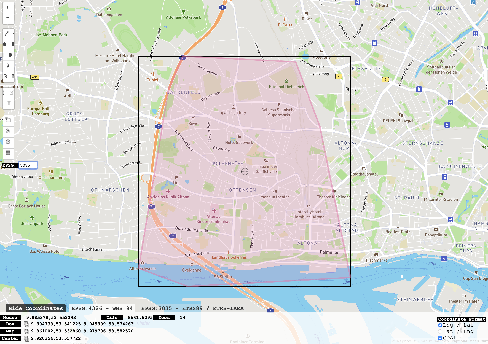

# ZensusGridSlicer
Ein kleines Python-Script, um Teilgebiete aus dem Gitterraster des BKG zu extrahieren

## 1. Grid herunterladen
 Grid-File herunterladen: [Website des BKG](https://gdz.bkg.bund.de/index.php/default/inspire/sonstige-inspire-themen/geographische-gitter-fur-deutschland-in-lambert-projektion-geogitter-inspire.html)
- Am besten Geopackage-Datei (zB als 100m Raster) herunterladen
- Entzippte GPKG im gleichen Ordner wie das Script speichern

## 2. Bounding Box herausfinden

Dazu [hier ein Polygon zeichnen](http://bboxfinder.com/#53.334973,9.639130,53.758454,10.430145)
- Links unter dem Menü bei "EPSG" das KBS eintragen: 3035
- Ganz unten steht "Hide Coordinates / Show Coordinates" - da muss man den Reiter für EPSG 3035 auswählen
- Dann die Koordinaten neben "Box" in das Script kopieren